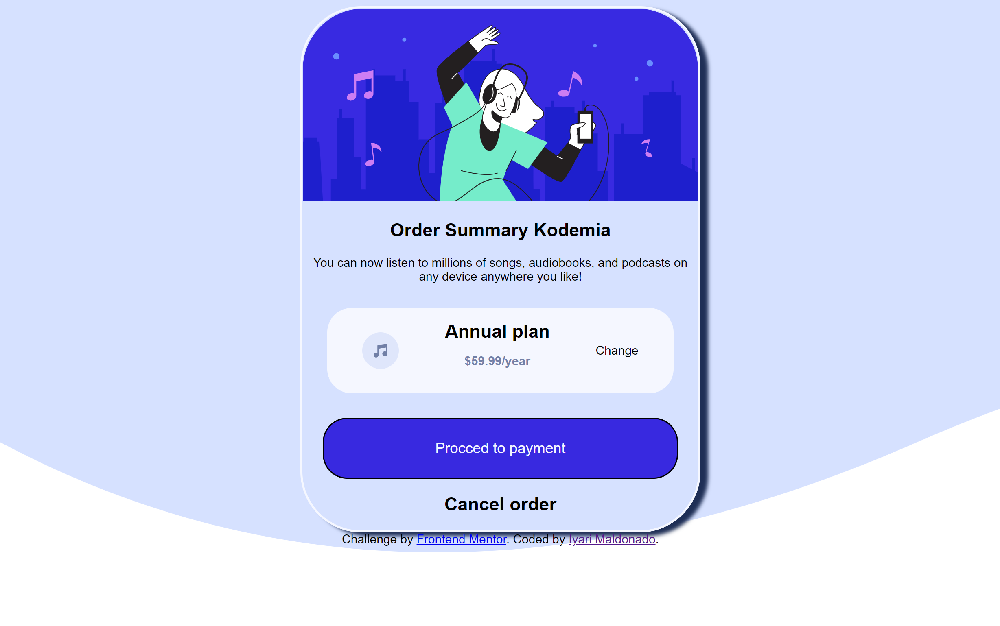

# Frontend Mentor - Order summary card solution

Esta es mi solución del reto [Order summary card challenge on Frontend Mentor](https://www.frontendmentor.io/challenges/order-summary-component-QlPmajDUj).

## Tabla de contenidos

- [Vista General](#vista-general)
  - [Acerca del reto](#acerca-del-reto)
  - [Screenshot](#screenshot)
- [Mi proceso](#mi-proceso)
  - [Hecho con](#hecho-con)
  - [Lo que aprendi](#lo-que-aprendi)
  - [Desarrollo continuo](#desarrollo-continuo)
  - [Recursos utiles](#recursos-utiles)
- [Autor](#autor)
- [Agradecimientos](#agradecimientos)

**Note: Delete this note and update the table of contents based on what sections you keep.**

## Vista general

### Acerca del reto

El usuario deberia poder:

- Ver los estados de navegación de los elementos interactivos
- Recrear la pagina mostrada en el ejemplo con los elementos necesarios

### Screenshot



## Mi proceso

### Hecho con:

- HTML
- CSS

### Lo que aprendi

Use los conocimientos adquiridos de 

#### Selectores

En este proyecto aplique los diferentes selectores que aprendi durante las clases 

Selector por elemento

```css
header img{
    width: 100%;
    height: auto;
    border-radius: 5rem 5rem 0rem 0rem;
}
```

Selector por clase

```css
.card-summary {
    margin: auto;
    text-align: center;
    border: 3px solid hsl(225, 100%, 98%);
    border-radius: 5rem;
    width: 40%;
    box-shadow: 10px 5px 5px hsl(223, 47%, 23%);
}
```

Selecto por id

```css
#cost {
    color: hsl(224, 23%, 55%);
}
```

### Desarrollo Continuo

De este proyecto observe que me falta más conocimientos acerca de CSS y manejo de las dimensiones, por lo que a futuro me gustaria mejorar en esos aspectos en este y otros proyectos que tenga


### Recursos utiles

- [W3C School](https://www.w3schools.com) - Este sitio tiene una explicación útil de como usar los elementos y los diferentes atributos que tienen

## Autor

- Website - [Iyari Maldonado Fiesco](https://github.com/MaestroMiyagi)
- Frontend Mentor - [@MaestroMiyagi](https://www.frontendmentor.io/profile/MaestroMiyagi)
- Twitter - [@corv_iyari](https://www.twitter.com/corv_iyari)
- Instagram - [@paco_el_chatoo](https://www.instagram.com/paco_el_chatoo/)

## Agradecimientos

Agradezco a los mentores de Kodemia, que me han enseñado bastantes cosas para poder empezar en el arduo camino, pero hermoso de diseño web
